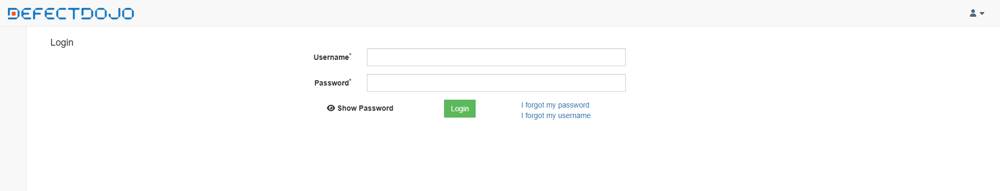
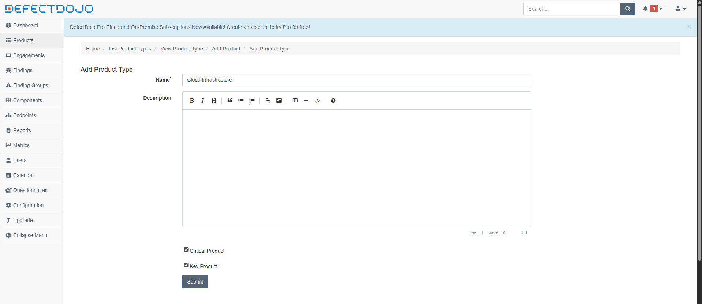
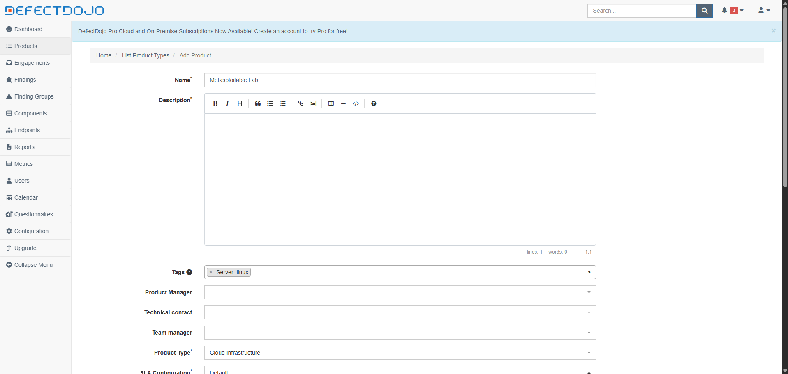
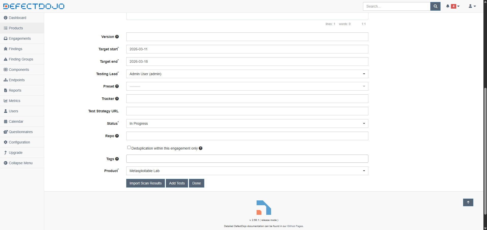
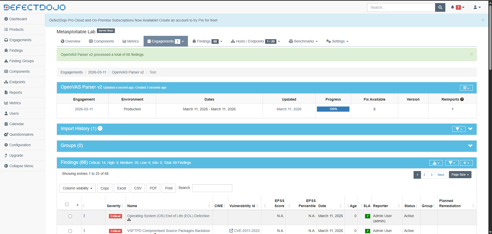
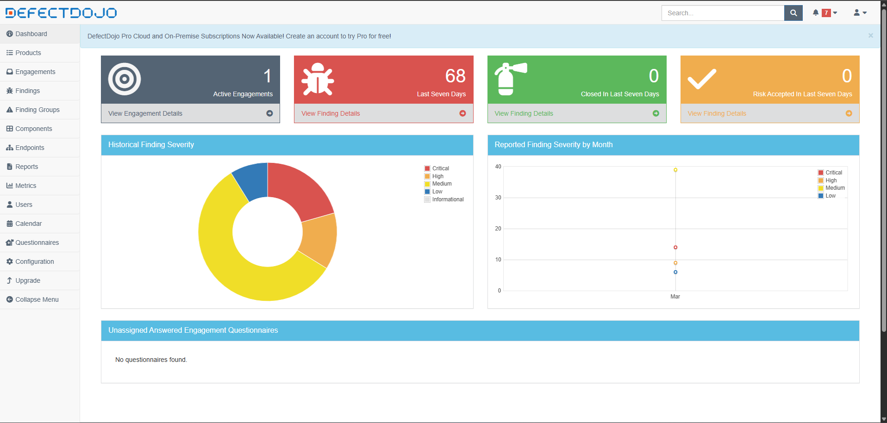

# 🛡️ DefectDojo – Orchestration & Finding Management

Centralized vulnerability management and deduplication of findings using **DefectDojo** to transform raw scan data into an actionable security roadmap.

## 🖥️ Environment

| Component | Role | Data Source |
| --- | --- | --- |
| **DefectDojo Stack** | Orchestration & Deduplication | Greenbone XML Reports |
| **PostgreSQL** | Persistent Finding Storage | N/A |
| **Redis/Celery** | Asynchronous Task Processing | N/A |

## 🐳 Deployment

DefectDojo runs as a multi-container microservices architecture. It handles the ingestion of diverse security tool outputs to provide a "single pane of glass."

```bash
cd /home/labuser/risk-driven-vm-lab/labs/defectdojo
docker compose up -d
# Monitor service initialization
docker compose logs -f uwsgi

```

## 🔐 Accessing the VMS Console

By default, the application is exposed on port **8080**. For remote management, we use secure port forwarding.

```bash
ssh -L 8080:127.0.0.1:8080 labuser@192.168.102.131

```

Navigate to `http://127.0.0.1:8080` and log in with the administrator credentials defined during setup.



## 🎯 Finding Ingestion & Modeling

To maintain enterprise-grade organization, findings are mapped to a specific business hierarchy before analysis.

1. **Product Modeling:**
* Navigate to **Products > Add Product Type**.
* Define a **Product Type** (e.g., *Cloud Infrastructure*).



* Navigate to **Products > Add Product**.
* Create the **Product** (e.g., *Metasploitable Lab*).
  


2. **Engagement Setup:**
* Within the Product, create a **New Engagement**.
* Set the status to *In Progress*.



3. **Importing Results:**
* Select **Import Scan Results**.
* **Scan Type:** `OpenVAS Parser v2`.
* **File:** Upload the `.xml` report exported from GSA.
* **Deduplication:** Enable *Deduplication* to group redundant findings across multiple ports.



## 📊 Results & Deduplication



Once imported, DefectDojo processes the XML data, normalizing the severity levels and merging identical CVEs.

* **Finding Consolidation:** Thousands of raw log lines are converted into distinct, manageable security "Findings."
* **Audit Trail:** Every finding maintains its original evidence from Greenbone while allowing for manual analyst verification.
