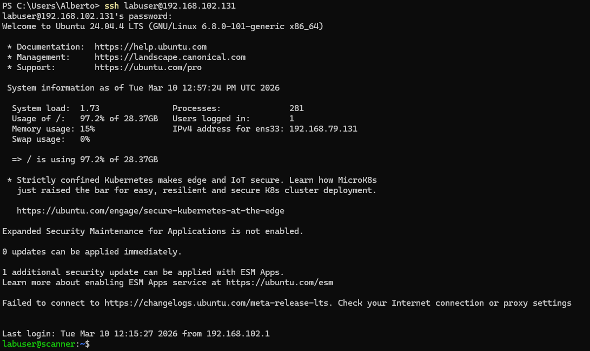
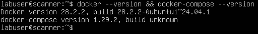
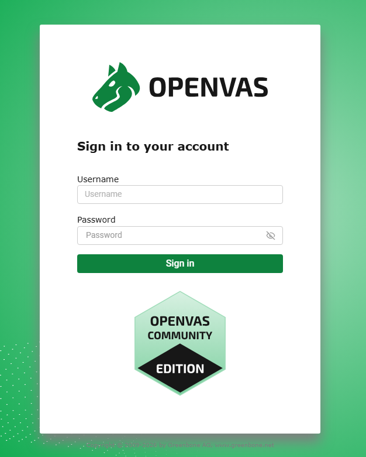
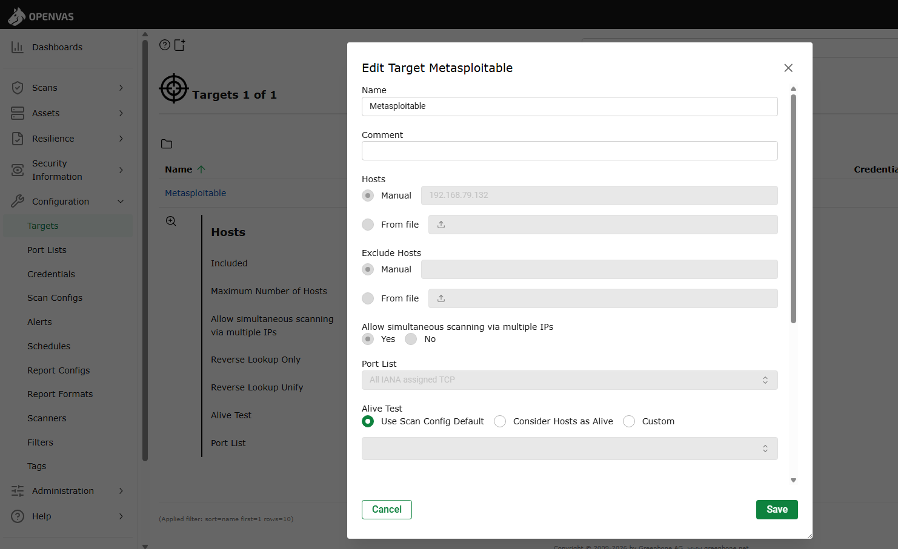
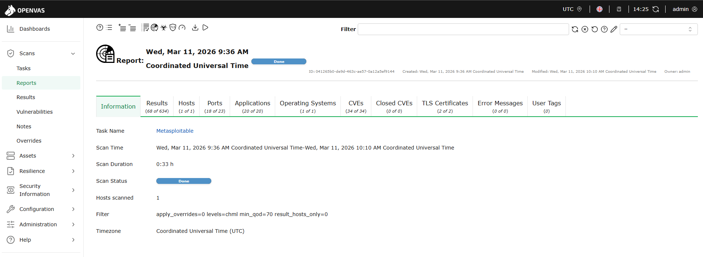
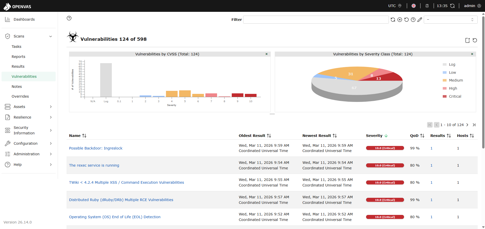
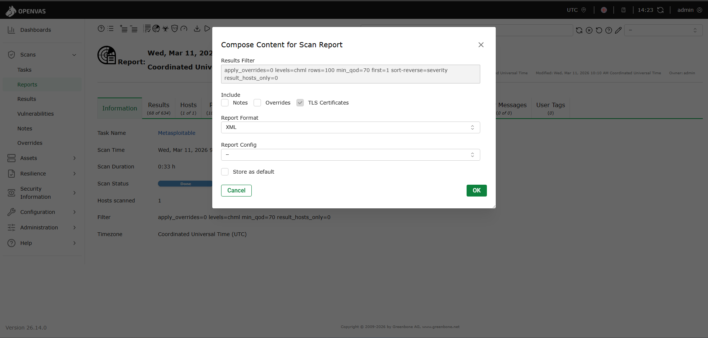

# 🔍 Greenbone CE – Deployment & Scanning

Automated vulnerability assessment using Greenbone Community Edition (OpenVAS)
against a Metasploitable 2 target in an isolated lab network.

---

## 🖥️ Environment

| Host | IP | Role |
|------|----|------|
| Ubuntu Server 24.04 LTS | 192.168.79.131 | Scanner (Greenbone CE) |
| Metasploitable 2 | 192.168.79.132 | Target |

Access from Windows operator workstation via SSH tunnel.

---

## 🐳 Deployment

Greenbone Community Edition runs fully containerized via Docker Compose.

    cd /home/labuser/greenbone-community-container
    docker compose up -d
    docker ps --format "table {{.Names}}\t{{.Image}}\t{{.Ports}}"

---

## 🔐 Accessing the GSA Web Console

GSA binds to `127.0.0.1:443` by design. Access is handled via SSH local
port forwarding — the management interface is never exposed on the network.

    ssh -L 8443:127.0.0.1:443 labuser@192.168.102.131

Navigate to `https://127.0.0.1:8443` and accept the self-signed certificate.

---

## 🎯 Target Configuration

To ensure accurate vulnerability assessment, the Metasploitable 2 target is configured within an isolated NAT network segment shared with the Scanner.

1. **Verify Connectivity:** Confirm the Scanner can reach the target.

    ping -c 4 192.168.79.132

2. **Define the Target:**
   * Navigate to **Configuration > Targets**.
   * Click the **New Target** (blue star) icon.
   * Set **Hosts** to `192.168.79.132`.
   * Set **Alive Test** to `ICMP Ping`.

3. **Task Setup:**
   * Navigate to **Scans > Tasks**.
   * Create a new task using the `Full and Fast` configuration for optimal performance.

---

### 📊 Scan Results

The GVM engine successfully processed 170k+ NVTs against the Metasploitable 2 target. The "Full and Fast" routine completed the vulnerability assessment, providing a comprehensive audit of the service landscape.

* **Scan Duration:** 33 minutes
* **Target:** 192.168.79.132

* **Findings Summary:**
* **Critical:** 13
* **High:** 8
* **Medium:** 31
* **Low:** 5

---

### 📥 Report Export & Orchestration

To transition from automated detection to risk-based management, the results are exported in **XML (v1)** format. This ensures full metadata preservation—including CVSS vectors, service descriptions, and references—necessary for accurate ingestion into DefectDojo.

1. Navigate to **Scans > Reports**.
2. Select the completed report for the Metasploitable 2 target.
3. Click the **Download** icon (top left).
4. Configure the export:
* **Format:** `XML`
* 

5. Save the report as `metasploitable_vulnerabilities.xml`.

---

### 🚀 Next Steps

With the evidence captured in the XML artifact, the project moves to the orchestration phase:

* **Data Ingestion:** Import `metasploitable_vulnerabilities.xml` into **DefectDojo**.
* **Risk Analysis:** Leverage the **EPSS** and **CISA KEV** integration within DefectDojo to prioritize remediation based on actual business impact and exploitability, rather than technical severity alone.

---

