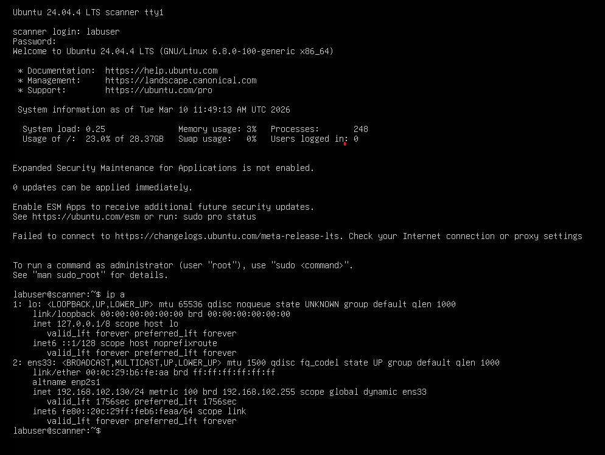

# 🔍 Greenbone CE – Deployment & Scanning

Automated vulnerability assessment using Greenbone Community Edition (OpenVAS)
against a Metasploitable 2 target in an isolated lab network.

---

## 🖥️ Environment

| Host | IP | Role |
|------|----|------|
| Ubuntu Server 24.04 LTS | 192.168.102.131 | Scanner (Greenbone CE) |
| Metasploitable 2 | TBD | Target |

Access from Windows operator workstation via SSH tunnel.

---

## 🐳 Deployment

Greenbone Community Edition runs fully containerized via Docker Compose.

    cd /home/labuser/greenbone-community-container
    docker compose up -d
    docker ps --format "table {{.Names}}\t{{.Image}}\t{{.Ports}}"

---

## 🔐 Accessing the GSA Web Console

GSA binds to `127.0.0.1:443` by design. Access is handled via SSH local
port forwarding — the management interface is never exposed on the network.

    ssh -L 8443:127.0.0.1:443 labuser@192.168.102.131

Navigate to `https://127.0.0.1:8443` and accept the self-signed certificate.

---

## 🎯 Target Configuration

> In progress

---

## 📊 Scan Results

> In progress
