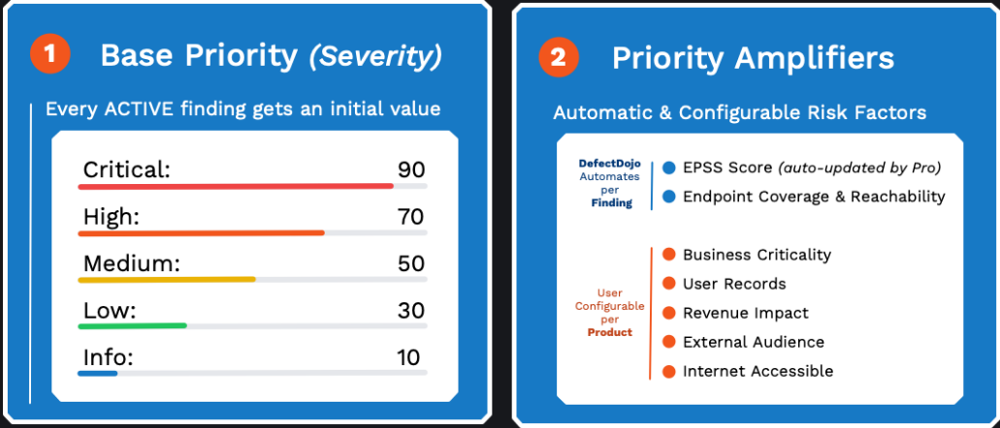
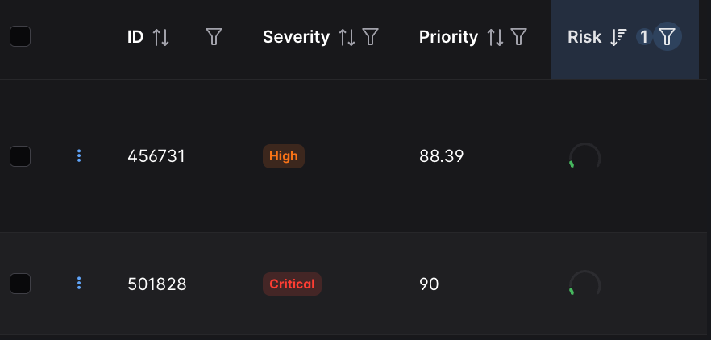
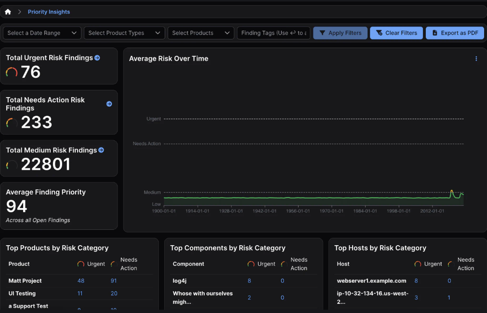
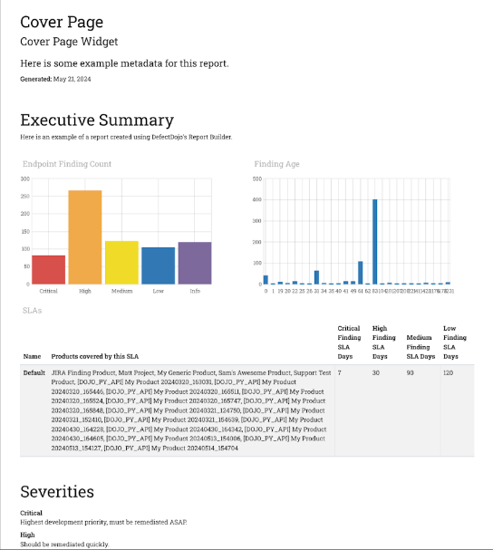

# 📈 Advanced Prioritization – EPSS & CISA KEV

Implementation of a **Risk-Driven** triaging strategy by enriching technical severity (CVSS) with real-world exploitation intelligence.

## ⚖️ The Prioritization Framework

Traditional VM relies on CVSS scores, which often lead to "patch fatigue." This lab implements a dual-filter approach:

* **CISA KEV (Known Exploited Vulnerabilities):** High-priority escalation for flaws currently exploited in the wild.
* **EPSS (Exploit Prediction Scoring System):** Data-driven probability scores indicating the likelihood of a vulnerability being exploited within the next 30 days.

## 🛠️ Implementation in DefectDojo

1. **Metadata Enrichment:**
* DefectDojo automatically links imported CVEs to the **NVD (National Vulnerability Database)**.

2. **Triaging Logic:**
* Navigate to **Findings**.
* Filter by **EPSS Score** (Percentile > 0.90) to identify "high-probability" threats.
* Identify findings with the **CISA KEV** tag for immediate remediation (P0).

## 📊 Risk-Based Analysis

By applying this logic, we separate **Technical Severity** from **Business Risk**.

* **Scenario A:** A CVSS Critical vulnerability with an EPSS of 0.001% (Low immediate risk).
* **Scenario B:** A CVSS High vulnerability listed in CISA KEV (Critical immediate risk).

> The final report focuses remediation efforts on **Scenario B**, significantly reducing the organization's attack surface with minimal operational overhead.

## 🚀 Final Delivery

* **Executive Dashboard:** Capturing the reduction in "Open Findings" through deduplication.

* **Remediation Roadmap:** A prioritized list of vulnerabilities based on the EPSS/CISA KEV intersection.

---
